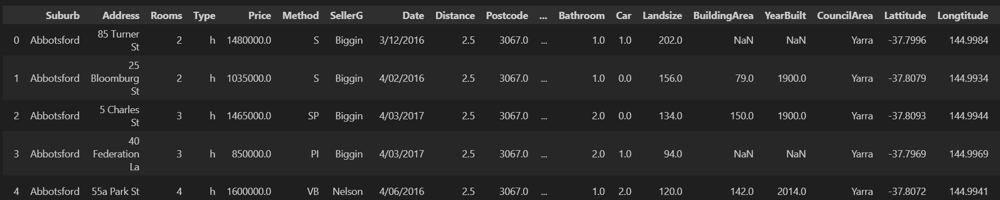
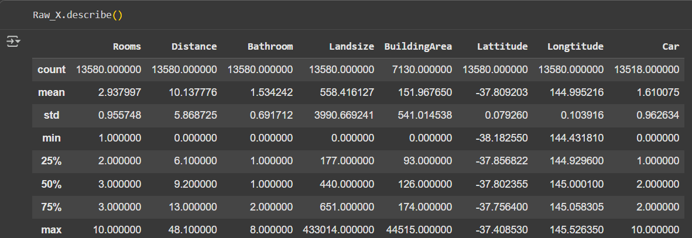

# HousePricePrediction_Model_Comparison
## Workflow:
This project demonstrates **supervised learning**, where the model is trained using **labeled data** — input features like 'Rooms', 'Distance', 'Bathroom', etc., and the target variable 'Price'. 
The model learns patterns from the data to predict house prices for new examples.

## Models Used:
The following tree-based regression models are implemented and compared in this demo:
1. **Decision Tree Regressor** – a single tree model predicting target values by splitting data based on feature thresholds.  
2. **Random Forest Regressor** – an ensemble of multiple decision trees to reduce variance and improve accuracy.  
3. **XGBoost Regressor** – a gradient boosting model that builds trees sequentially to correct previous errors, optimized for speed and performance.

## Dataset Sample:

## Data Preprocessing:
Before training the models, the dataset was cleaned and prepared to ensure better performance:

1. **Handling Missing Values**
   - `BuildingArea` and `Car` columns had missing entries.
   - Used **median imputation** to fill missing values.
   - Models cannot be processed with missing values. To address this, we fill those fields with the most relevant value from other values, this could be mean, median, or any value technically. But we need to decide which would be the best for us to avoid over/under fitting or data unbalance.

2. **Handling Extreme Values / Outliers**
   - `BuildingArea` values above the upper bound (calculated using IQR) were capped to reduce skew.
   - `Landsize` values above the 99th percentile were capped to limit extreme effects on the model.

3. **Feature Selection**
   - Selected relevant features: `Rooms`, `Distance`, `Bathroom`, `Landsize`, `BuildingArea`, `Lattitude`, `Longtitude`, `Car`.
   - Target variable: `Price`.

